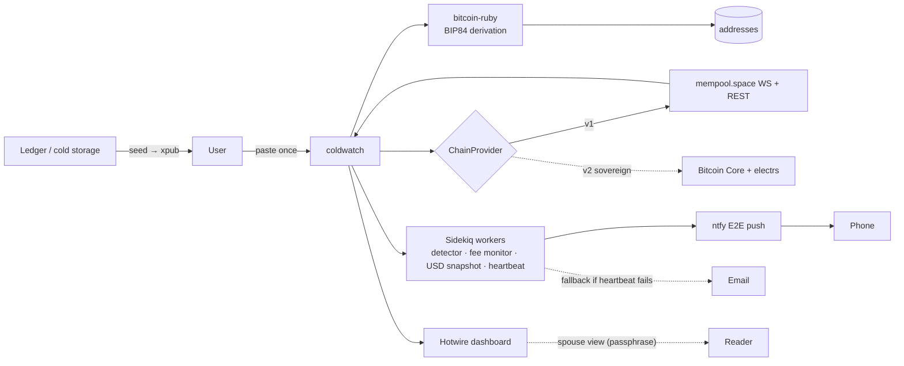

# coldwatch

A self-hosted, watch-only Bitcoin cold-storage sentinel.

> Watch-only. No private keys. Not now, not ever.

`coldwatch` watches a Bitcoin wallet's extended public key (xpub) and pushes a sub-second alarm to your phone the moment any outgoing transaction is detected — giving you a fight-back window to broadcast a higher-fee replacement to a fresh address you control before the attacker's transaction confirms.

It also tracks fee-window alerts, daily USD-value snapshots, UTXO hygiene, address reuse, and exports a Form-8949-ready CSV.

## Architecture



See `docs/architecture.md` for the full sequence diagram.

## Features

- Sub-second outgoing-tx alarm via E2E-encrypted ntfy push
- Email heartbeat fallback if ntfy stops responding to test pings
- Reorg-aware confirmation tracking (0-conf alarm, 6-conf settled)
- Fee-window alerts (configurable threshold)
- UTXO map with age, dust flagging, current spend cost
- Address-reuse + gap-limit warnings
- Daily USD-value snapshots → CSV export ready for Form 8949
- Read-only "spouse view" with passphrase (inheritance / continuity)

## Stack

Rails 7.2, PostgreSQL 16, Sidekiq + Redis, mempool.space WebSocket (REST for initial-state catchup), Caddy + Let's Encrypt, Docker Compose. Bitcoin Core support planned for v2 (sovereign mode — your xpub never leaves your machine).

## What's in this repo right now (v0 scaffold)

This is the **scaffold** — infrastructure, docs, and CI guardrails. The Rails apps themselves are bootstrapped on Day 1 of the build; see `BOOTSTRAP.md`.

- `docs/architecture.md`, `docs/threat-model.md`, `docs/runbook.md`, `docs/migration-emergency.md`, `docs/ledger-setup.md`
- `personal/` and `demo/` — two independent Docker Compose stacks
- `caddy/` — single Caddy reverse proxy fronting both, IP-allowlist for personal, public for demo
- `scripts/grep-xpub-guard.sh` — fails CI if any xpub-shaped string lands in tracked files
- `.github/workflows/ci.yml` — runs the guard on every push and PR

## Quickstart (after Day 1 bootstrap)

```bash
# One-time: customize caddy/Caddyfile with your domain + home IP allowlist
cp caddy/.env.example caddy/.env

# Bring up each stack independently
(cd personal && cp .env.example .env && docker compose up -d)
(cd demo && cp .env.example .env && docker compose up -d)
(cd caddy && docker compose up -d)
```

Personal lives at `https://coldwatch.{your-domain}`. Demo lives at `https://demo.{your-domain}`.

## Privacy and threat model

**Read `docs/threat-model.md` before pasting your real xpub.** Short version: a leaked xpub cannot spend a single satoshi, but it does reveal every address and transaction you have ever made or will ever make, forever. The threat model is honest about what `coldwatch` defends against and what it does not.

## What `coldwatch` is NOT

- Not a wallet. It cannot sign or spend. It only watches.
- Not a custodian. Your private keys never leave your hardware wallet.
- Not a tax tool. It exports the data; you (or your CPA) fill out Form 8949.
- Not magic. A sophisticated attacker with your seed can still win the fee war. See `docs/runbook.md` for a realistic assessment.

## License

MIT
