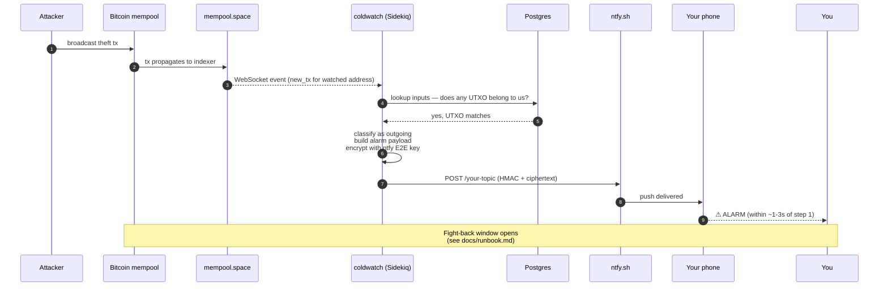
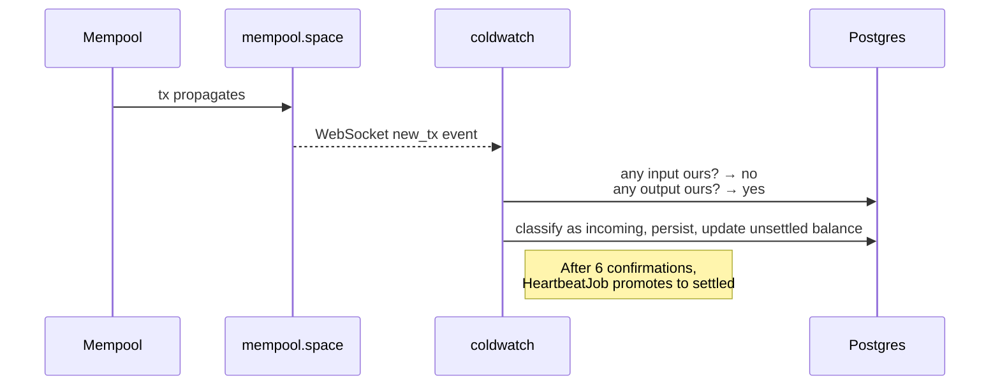
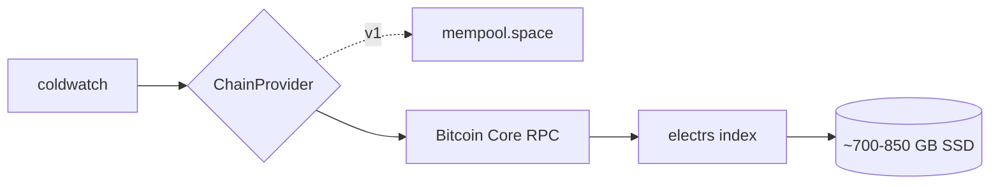
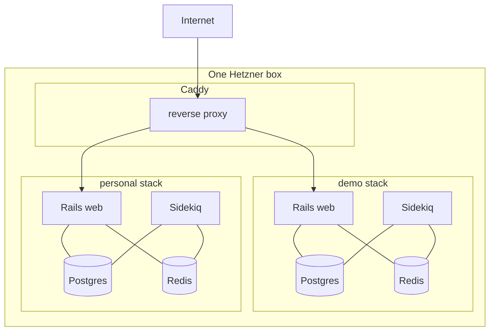

# Architecture

## Components

| Component | Role |
|---|---|
| **Rails web** | Hotwire dashboard, xpub-input form, spouse-view route, CSV export |
| **Sidekiq** | `MempoolSocketWorker`, `OutgoingTxDetector`, `FeeMonitor`, `UsdSnapshotJob`, `HeartbeatJob` |
| **PostgreSQL** | Wallets (xpub encrypted at rest), Addresses, Transactions, UTXOs, Snapshots, AlertEvents |
| **Redis** | Sidekiq queue + ephemeral state (last-seen mempool cursor, ntfy heartbeat status) |
| **ChainProvider abstraction** | v1: mempool.space WebSocket + REST. v2: Bitcoin Core RPC + electrs. One interface, swappable. |
| **Caddy** | TLS termination, IP allowlist for personal, public for demo, automatic Let's Encrypt |
| **ntfy.sh** | E2E-encrypted push delivery (provider sees ciphertext only) |

## Data flow — the alarm path (the path that matters)

## Data flow — incoming transaction (boring path)

## Reorg handling

A transaction with N confirmations can lose them if the chain reorganizes. `coldwatch` accounts for this by maintaining two balance views:

- **Unsettled balance** (0–5 confs) — what's *probably* yours; updated on every event
- **Settled balance** (6+ confs) — what's *definitely* yours; only this is used for daily USD snapshots and CSV export

If a reorg drops a previously-confirmed tx back to the mempool, `coldwatch` reconciles by walking forward from the last common block height and re-applying the new chain.

## Privacy boundaries

| Boundary | Who sees the xpub | Mitigation |
|---|---|---|
| Your laptop browser → coldwatch web | Your machine + Hetzner box | TLS everywhere (Caddy + Let's Encrypt) |
| coldwatch app → Postgres | The Postgres process | Rails 7 `encrypts :xpub`, AES-256-GCM, master key in env |
| Postgres → Hetzner snapshots | Hetzner storage layer | Snapshot contains ciphertext only |
| coldwatch → mempool.space | mempool.space and any network observer | **Inevitable in v1.** Fixed in v2 by running your own Bitcoin Core. |
| coldwatch → ntfy | Nobody beyond your phone | ntfy E2E encryption — provider sees ciphertext only |

## v2 sovereign mode (planned)

Same Hetzner box, larger volume. Initial sync ~1–3 days. After sync, `coldwatch` queries only your local node. mempool.space (and the rest of the world) never sees a single address from your wallet again.

A single config flag flips the provider: `CHAIN_PROVIDER=mempool_space` → `CHAIN_PROVIDER=bitcoin_core`. The `ChainProvider` interface is the same. No callsite changes.

## Two-stack deployment

Each stack has its own Postgres and Redis. The only shared resource is the Caddy reverse proxy, on a dedicated Docker network (`coldwatch_web`). A bug in `demo` cannot read `personal`'s database.
